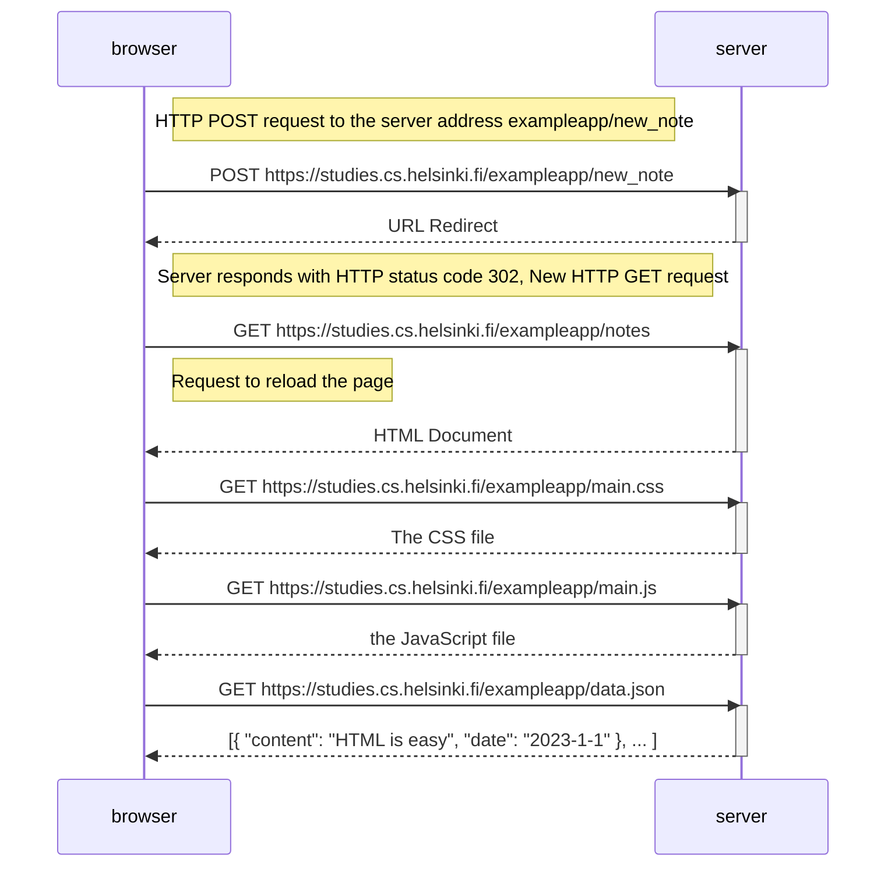

```mermaid
sequenceDiagram
    participant browser
    participant server
    
    Note right of browser: HTTP POST request to the server address exampleapp/new_note
    browser->>server: POST  https://studies.cs.helsinki.fi/exampleapp/new_note
    activate server
    server-->>browser: URL Redirect
    deactivate server
    Note left of server: Server responds with HTTP status code 302, New HTTP GET request
    
    browser->>server: GET https://studies.cs.helsinki.fi/exampleapp/notes
    activate server
    Note right of browser: Request to reload the page
    server-->>browser: HTML Document
    deactivate server

    browser->>server: GET https://studies.cs.helsinki.fi/exampleapp/main.css
    activate server
    server-->>browser: The CSS file
    deactivate server
    
    browser->>server: GET https://studies.cs.helsinki.fi/exampleapp/main.js
    activate server
    server-->>browser: the JavaScript file
    deactivate server
        
    browser->>server: GET https://studies.cs.helsinki.fi/exampleapp/data.json
    activate server
    server-->>browser: [{ "content": "HTML is easy", "date": "2023-1-1" }, ... ]
    deactivate server
```
