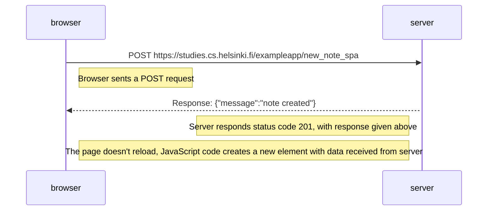

```mermaid
sequenceDiagram
    participant browser
    participant server
  
    browser->>server: POST https://studies.cs.helsinki.fi/exampleapp/new_note_spa
    Note right of browser: Browser sents a POST request 
    activate server
    server-->>browser: Response: {"message":"note created"}
    Note left of server: Server responds status code 201, with response given above  
    Note right of browser: The page doesn't reload, JavaScript code creates a new element with data received from server
```
